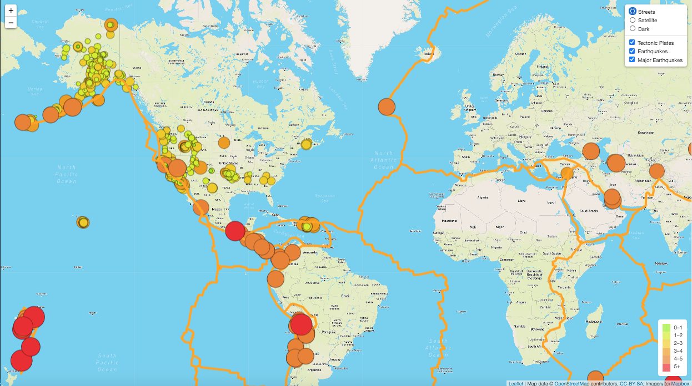
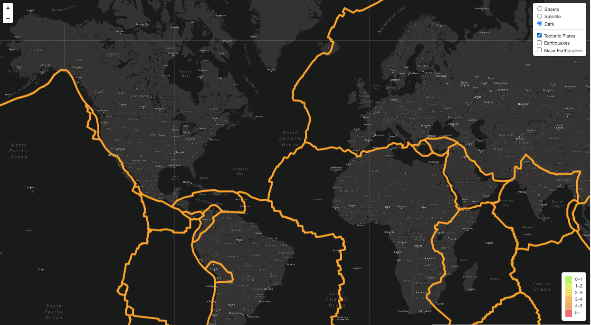

# Mapping_Earthquakes

## Overview of the Project

The purpose of this project was to use JavaScript with Leaflet and D3 libraries in order to build a dynamic, interactive map of global earthquakes and tectonic plates data from the past seven days, retrieved from GeoJSON formatted sources.  The data was plotted onto Mapbox maps through API requests in order provide various selectable tile layers and overlays to accommodate a few key map styles and data selection criteria choices for a particular user.

---------------------------------------------
## Resources:

Data Sources: 
https://raw.githubusercontent.com/fraxen/tectonicplates/master/GeoJSON/PB2002_boundaries.json
https://earthquake.usgs.gov/earthquakes/feed/v1.0/summary/4.5_week.geojson
https://earthquake.usgs.gov/earthquakes/feed/v1.0/summary/all_week.geojson

Software: 

    Chrome DevTools 86.0.4240.198, Visual Studio Code 1.49.2,
    HTML5, ES6, D3 v6, Leaflet.js 1.7.1, Mapbox

---------------------------------------------

## Results

The global earthquakes and tectonic plates analysis produced a visually intuitive story about the magnitudes of seismic activity around the globe in a week's time.  It also provided a useful display for comparing the tectonic plate geography with the earthquake data.  By incorparting leaflet, Mapbox, and JavaScript, users are able to interact with the data to toggle on and off map styles and/or the given data overlays. As can be seen at the top right corner of the map images displayed below, the toggling is simple and labeled.  Here, we see the default map display.  The circle size and color correspond to the magnitude of the earthquake.  On the bottom-right corner we see a leged as well.

As another example, here is a toggled version which includes a different mapbox map style, in this case "dark", onto which only the tectonic plate option is selected.  Of course, the given selection criteria for the earthquakes could easily be altered to contain more or less options if desired.

## Summary

Ultimately, the project was able to succesfully create a highly intuitive and customizable visualization for the retrieved GeoJSON data.  Of course, this analysis could easily be expaned to a practically limitless number of mapping applications.  Among the multitude of contending tools and applications widely available for such data visualization, Leaflet, JavaScript, D3, and Mapbox APIs certainly prove as a powerful team for use in geographical storytelling using GeoJSON data.